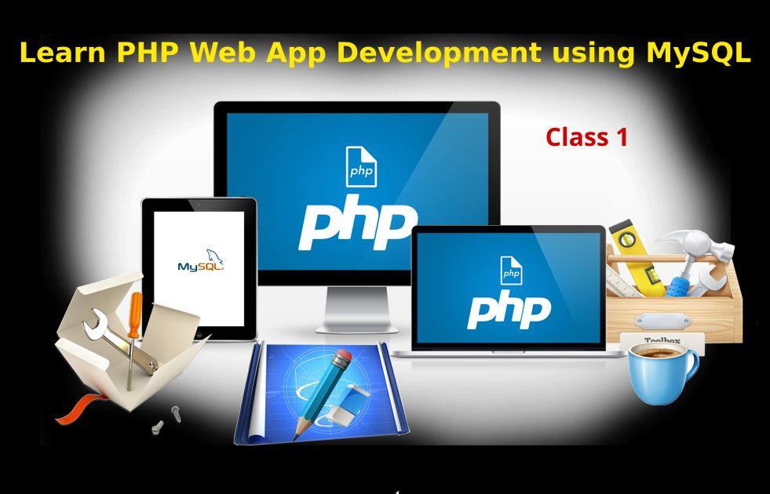

# السلام علیکم ورحمتہ اللہ وبرکاتہ
Hi,  
دوستو  

# Associated YouTube video playlist 
https://www.youtube.com/playlist?list=PLuSlqiqQkM0wSHcgl7CjEYg51PxsCwMVd

# Course Intro (*very brief*): Learn PHP Web App Development using MySQL
<!--  -->
 [^1]

* Why you are learning this course?
* Why I'm teaching this course?
* Course style
* Course Fee! Don't worry :slightly_smiling_face:	

# My Intro
* Aamir Shahzad
* DCS, IDCS, IADCS, MCS
* Programming, Linux & Open Source
* Few of my Linux distros/Respins
* RoshanTech
* Attock City
* [eSite.pk](http://esite.pk/)
* [YouTube.com/asakpke](https://www.youtube.com/asakpke)

# Course Intro: Learn PHP Web App Development using MySQL
* What's PHP, web app, MySQL/PhpMyAdmin
* Why you are learning this course? Job? Business/Products?
* Why I'm teaching this course? Create you own digital asset
* Course style is direct/fast, no basics, more later on. Don't worry, I'll try to explain briefly
* Course Fee! Pay as you like :slightly_smiling_face:	

> Account Holder: Aamir Shahzad  
> Account No: 52010100479581  
> Bank Name: Meezan Bank  
> City: Attock City  
> Branch Code: 5201  
> IBAN No: PK97MEZN0052010100479581  

You can pay fee whatever you can afford :innocent: Even if it's just a rupee/dollar, we appreciate it.

# Learn Basic Programming
[Learn Computer Programming on Your Mobile Phone](https://www.youtube.com/playlist?list=PLuSlqiqQkM0yE5z2PF9wjyHM9_FHOo9Ew) 

# Learn Basic Development
* [Learn Professional Web Development HTML (Paid Course)](https://esite.pk/product/learn-professional-web-development-html-course/) 
* [My Older FREE Wide Development (FWD) Live Sessions](https://www.youtube.com/playlist?list=PLuSlqiqQkM0wepYUxRHnZVdeQvVOcwP9f)
* Learn basic HTML/CSS/JS/PHP/SQL etc on [W3Schools.com](https://www.w3schools.com/)
* [Learn PHP, MySQL And Web Development In Urdu Language By Shakeel Muhammad Khan](https://itechsoul.com/learn-php-mysql-and-web-development-in-urdu-language-by-shakeel-muhammad-khan-on-flip-pages/)
## And advanced on 
* [W3.org](https://www.w3.org/), official website
* [PHP.net](https://www.php.net/), official website
* [w3.org/html](https://www.w3.org/html/)
* [w3.org/css](https://www.w3.org/Style/CSS/)
* [validator.w3.org](https://validator.w3.org/)
* [developer.mozilla.org](https://developer.mozilla.org/en-US/)
* [MySQL](https://www.mysql.com/) or [MariaDB](https://mariadb.com/), official websites
* [PhpMyAdmin](https://www.phpmyadmin.net/), official websites
* [Stack Overflow](https://stackoverflow.com/), official websites

# DigiSkills.pk
Learn 15 courses, specially freelancing
[DigiSkills.pk](https://digiskills.pk/)

# Basics
* Client/Server side 
* Front/Back end development 
* Full stack developer 

# Install WAMP/LAMP/MAMP/XAMPP
https://www.apachefriends.org/download.html

# Hello World PHP Program
```php
<?php echo 'Hello World' ?>
<?= 'Hello World' ?>
```
Also without closing tag

# Ending
https://github.com/asakpke/

# Signal/WhatsApp Groups for Q/A
▶️ YouTube.com/asakpke  
یہ گروپ مفت وائیڈ ڈویلپمنٹ سیکھانے کے لیے بنایا ہے۔ کیونکہ یہ گروپ اوپن ہے اسلیے کوئی بھی غیر معقول/متعلقہ شئیرنگ کر سکتا ہے جسے گروپ سے ممکنہ نکال دیا جائے گا۔ ہر ممبر کی ذمہ داری ہے کہ وہ اپنی طرف سے ایسی پوسٹ کو ڈیلیٹ کردیں۔

https://signal.group/#CjQKIIssIuNAzXUTNutw2TIOPso2Hw3W11Lc6nFELTzPQQHSEhD4buQi25ABWVuAyoZKfevd

https://chat.whatsapp.com/EhEIPA7HdKb6MnvlzwyqLa

آپ بےشک اس گروپ کو ہر جگہ شئیر کریں، شکریہ 🙏

عامر شہزاد  
RoshanTech  
www.eSite.pk  

[^1]: "<a href=https://www.pngall.com/web-development-png/download/12773 target="_blank">Web Development PNG Image</a>" by <a href="pngall">PNGAll</a>, used under <a href="http://creativecommons.org/licenses/by/4.0/">CC BY 4.0</a> / Text & background added from original